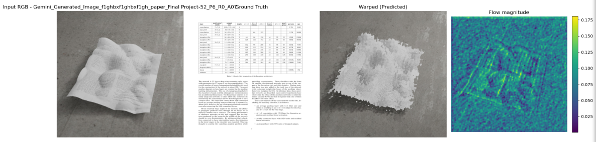
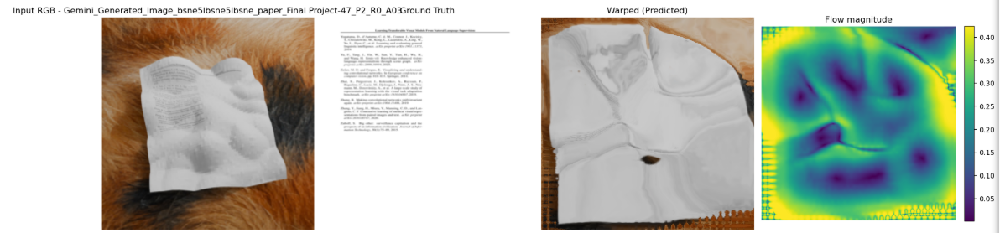
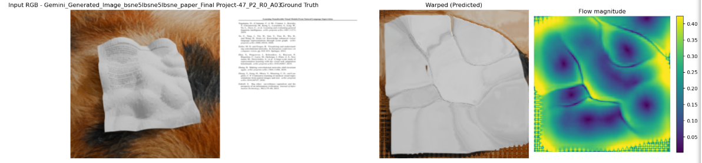
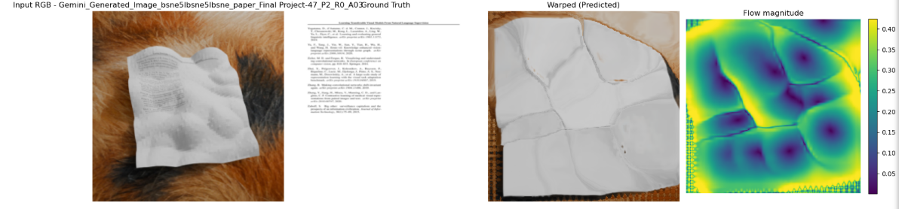
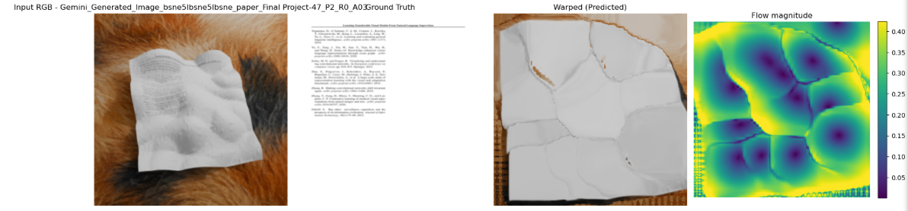
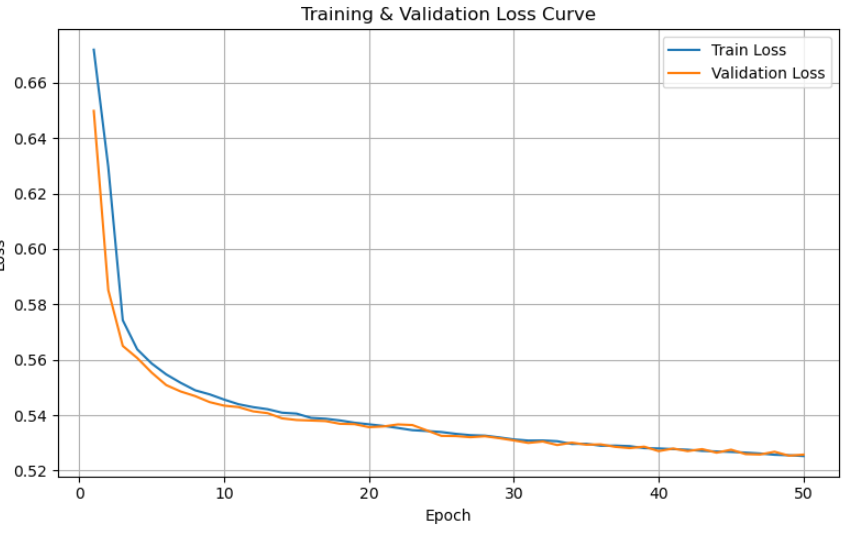
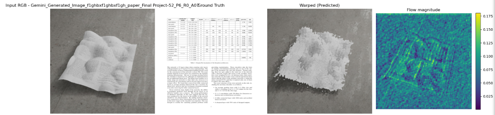
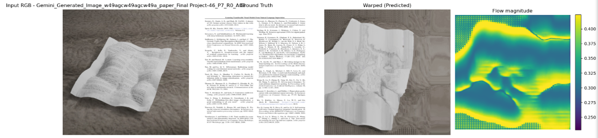
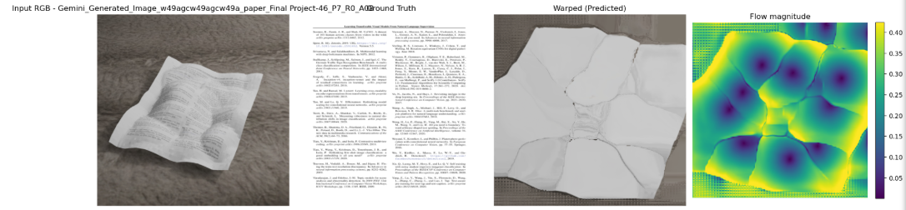

# Deep Document Unwarping

**Author:** Daniel Choate 

**Course:** Computer Vision - Final Project (Fall 2025)

**Instructor:** Roy Shilkrot

---

## GOAL 

To design and train a deep learning pipeline that reconstructs a flat, readable document from an image of a crumpled or folded page. 

**Input**: Crumpled document image

**Output**: Flat, rectified document image

## Overview

To achieve the goal of document dewarping, I have implemented a pretrained ResNet-34 backbone encoder followed by a UNet style decoder. The loss function used was a UV Reconstruction Loss function which combines SSIM reconstruction loss and flow smoothness regularization. The initial results showed to be extremely noisy, lacking text structure and fine details. Later epochs steadily improved geometric alignment of the warped page, producing straighter line structures and reduced background distortion.

## Architecture 

<table align="center">
  <tr align="center">
    <td><b>Document contour</b></td>
  </tr>
  <tr>
    <td></td>
  </tr>
</table>

The model consists of a pretrained ResNet encoder and U-Net decoder architecture, designed to predict a geometric deformation field for document unwarping, rather than directly generating pixel intensities. The pretrained ResNet backbone (ResNet-34) extracts hierarchical features from the warped input image. These features feed into the U-Net style decoder with skip connections, preserving spatial details as the network upsamples back to full resolution. The final decoder features pass through a lightweight convolutional head that predicts a 2-channel flow field representing per-pixel coordinate offsets in normalized grid space. The flow is added to a sampling grid, yielding a differentiable "unwarped" reconstruction of the flat document. Training used AdamW (lr=1e-4, weight decay=0.01) with batch size 8 for 50 epochs on an RTX 4060 GPU.

---
## Loss Function

Early experiments used a basic L1 loss, directly comparing pixel intensities between the warped output and the ground-truth flat document. While simple, this approach is highly sensitive to illumination changes. Warped images often contain shading, shadows, highlights that do not exist in the rectified target. Border masks were applied to constrain reconstruction loss to document pixels, preventing gradients from leaking into background regions and stabilizing early training. Even when applying a masked L1 loss, optimization tended towards lighting changes instead of geometry, and the network struggled to meaningfully warp the page. 

To handle this limitation, I incorporated a perceptual geometric loss using SSIM, which focuses on structural similarity (edges and contrast) instead of raw pixel value. SSIM is more robust to lighting inconsistencies and is better aligned with the goal of recovering page geometry. Continuing to build on this, the final system uses a combined loss through `UVReconstructionLoss`, which integrates three objectives: 

(1) SSIM-based reconstruction of unwarped outputs

(2) UV flow or flow supervision to guide the network toward the correct spatial correspondence

(3) A smoothness prior on the predicted flow field to enforce smooth deformations

This combined approach produced the strongest rectification behavior and the cleanest loss curves in my experiments. 

---
## Results

Using the initial basic L1 loss, the predicted rectified image resembled strictly single color sheets, similar to that of the background of the image. When implementing the SSIM loss function, resemblance of a document began to form after several epochs, but many images converged to the same shape, and continued to color the background white. Coherent rectification only emerged after introducing the combined UV–SSIM loss, which led the decoder toward meaningful spatial mappings.

Full-resolution (512×512) training was tested selectively because of memory constraints, but preliminary runs showed similar qualitative trends.

The first image shows an input image, ground truth, and initial prediction based on an initial flowfield magnitude, essentially showing noise. This is followed by the updated prediction and flow magnitude at 5, 20, and 50 epochs. 

<h2 align="center">256 × 256 Pixel Training</h2>
<table align="center">
  <!-- Row 1 -->
  <tr align="center"><td><b>Initial (epoch 0)</b></td></tr>
  <tr><td></td></tr>

  <!-- Row 2 -->
  <tr align="center"><td><b>5 epochs</b></td></tr>
  <tr><td></td></tr>

  <!-- Row 3 -->
  <!-- <tr align="center"><td><b>10 epochs</b></td></tr>
  <tr><td></td></tr> -->

  <!-- Row 3 -->
  <tr align="center"><td><b>20 epochs</b></td></tr>
  <tr><td></td></tr>

  <!-- Row 3 -->
  <tr align="center"><td><b>50 epochs</b></td></tr>
  <tr><td></td></tr>

  <!-- Row 3 -->
  <tr align="center"><td><b></b></td></tr>
  <tr><td></td></tr>
</table>

<h2 align="center">512 × 512 Pixel Training</h2>
<table align="center">
  <!-- Row 1 -->
  <tr align="center"><td><b>Initial (epoch 0)</b></td></tr>
  <tr><td></td></tr>

  <!-- Row 2 -->
  <tr align="center"><td><b>5 epochs</b></td></tr>
  <tr><td></td></tr>

  <!-- Row 3 -->
  <!-- <tr align="center"><td><b>10 epochs</b></td></tr>
  <tr><td></td></tr> -->

  <!-- Row 3 -->
  <tr align="center"><td><b>20 epochs</b></td></tr>
  <tr><td></td></tr>

  <!-- Row 3 -->
  <tr align="center"><td><b>50 epochs</b></td></tr>
  <tr><td></td></tr>

  <!-- Row 3 -->
  <tr align="center"><td><b></b></td></tr>
  <tr><td></td></tr>
</table>

---
## Metrics

A final validation metric was calculated for the model after training. The final loss (UVReconstructionLoss total) was 0.4823 on the validation set, while the final SSIM score on the validation set was 0.2322. An SSIM of 0.23 is low in absolute terms, indicating that while the model learns coarse geometry, it does not yet reproduce high-frequency structure such as glyphs or texture patterns.

---
## Future work
While the current ResNet-UNet-based solution demonstrates meaningful structural improvement, there is still substantial room to advance document recovery quality. The model often fails to preserve fine-grained content, like printed text, which suggests that critical spatial cues are being lost during reconstruction. Limited compute resources (a GeForce RTX 4060 with 8GB VRAM) constrained the scale of experiments and model capacity, but the observed progression across epochs shows that the pipeline is capable of learning meaningful geometric connections. 

Going forward, several directions are promising:

- Depth integration: utilizing the depth maps will provide explicit 3-D geometry, enabling the network to model surface curvature and recover small-scale details more reliably
- Transformer-based architectures: vision transformers or hybrid CNN-Transformer designs may offer better global context, improving text preservation
- Scaling training: larger resolution, bigger batch sizes, or multi-GPU training could improve convergence and output quality

Ultimately, these developments aim at the outcome of generating a reconstructed document that a human can comfortably read. 

---

**Code base**
- `model.py` torch model definition (Resnet-34 encoder backbone, U-Net decoder, unwarping logic)
- `training.ipynb` code used to train model and loss curves 
- `training_val.py` training and validation functions used in `train.ipynb`
- `evaluate.py` loads weights and calculates SSIM on validation set
- `best_model_256.pth` trained model weights for 256x256 pixel images
- `training_history_256.pth` training history to recreate loss curves for 256x256 pixel images
- `best_model_512.pth` trained model weights for 512x512 pixel images
- `training_history_512.pth` training history to recreate loss curves for 512x512 pixel images

