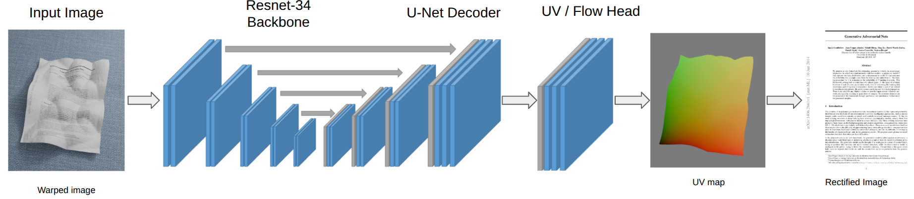

# Deep Document Unwarping

**Author:** Daniel Choate 

**Course:** Computer Vision - Final Project (Fall 2025)

**Instructor:** Roy Shilkrot

---

## GOAL 

To design and train a deep learning pipeline that reconstructs a flat, readable document from an image of a crumpled or folded page. 

**Input**: crumpled document image

**Output**: Flat, recitified document image

## Overview

To achieve the goal of document dewarping, I have implemented a pretrained backbone encoder followed by a UNet style decoder. The loss function used was a UV Reconstruction Loss function which combines SSIM reconstruction loss and flow smoothness regularization. The initial results showed to be extremely noisy, lacking text structure and fine details, but further iterations continue to move towards a solution capable of flattening the input image to higher accuracy. In the next sections, I will outline the architecture, loss function, resuls, metrics, and future work. 

## Architecture 

<table align="center">
  <tr align="center">
    <td><b>Document contour</b></td>
  </tr>
  <tr>
    <td></td>
  </tr>
</table>

The model consists of a pretrained ResNet encoder and U-Net decoder architecture, designed to predict a geometric deformation field for document unwarping, rather than directly generating pixel intensities. The pretrained ResNet backbone (ResNet-34) extracts hierarchical features from the warped input image. These features feed into the U-Net stle decoder with skip connections, preserving spatial details as the network upsamples back to full resolution. The final decoder features pass through a lightweight convolutional head that predicts a 2-channel flow ield representing per-pixel coordinate offsets in normalized grid space. The flow is added to a sampling grid, yielding a differentiable "warped" reconstruction of the flat document.

---
## Loss Function

Early experiments used a basic L1 loss, directly comparing pixel intensities between the warped output and the ground-truth flat document. While simple, this approach is highly sensitive to illumniation changes. Warped images oftn contain shading, shadows, highlights that do not exist in the recitified target. Even when masking out the background and applying a masking L1 loss, optimization tended towards lighting changes instead of geometry, and the network struggled to meaningfully warp the page. 

To handle this limitation, I incorporated a perceptual geometric loss using SSIM, which focuses on structural similarity (edges and contrast) instead of raw pixel value. SSIM is more robust to lighting inconsistencies and is better aligned with the goal of recovering page geometry. Continuing to build on this, the final system uses a combined loss through `UVReconstructionLoss`, which integrates three complementary objectives: 

(1) SSIM-based reconstruction of warped output, 
(2) UV flow or flow supervision to guide the network toward the correct spatial correspondence
(3) A smoothness prior on the predicted flow field to enforce smooth deformations

This combined approach produced the strongest rectification behavior and the cleanest loss curves in my experiments.

---
## Results

Using the initial basic L1 loss, the predicted rectified image resembled strictly single color sheets, similar to that of the background of the image.  

---
## Metrics

---
## Future works 
Things to hit on: using depth data, transformer based architecture

---
### TODO 
**Milestone 1**
- [x] Load and visualize dataset 
- [x] Implement simple encoder-decoder model
- [x] Train on the dataset with MSE loss 
- [x] Evaluate on validation set 

**Milestone 2**
- [x] Integrate pretrained backbone
- [x] Add skip connections (U-Net style)
- [x] Experiment with different loss functions (L1, perceptual, SSIM)
- [ ] Check todo list for training metrics
- [ ] Implement proper evaluation metrics 

**Milestone 3** (if time)
- [ ] Use depth/UV information 
- [ ] Add attention mechanisms
- [ ] Implement adversarial training (GAN)
- [ ] Try transformer-based architectures
- [ ] Ensemble multiple models

**Code base**
- `model.py` torch model definition (Resnet-34 encoder backbone, U-Net decoder, unwarping logic)
- `train.ipynb` code used to train model and loss curves 
- `training_val.py` training and validation functions used in `train.ipynb`
- `evaluate.py` loads weights and calculates SSIM on validation set
- `best_model.pth` trained model weights 
- `training_history.pth` training history to recreate loss curves

